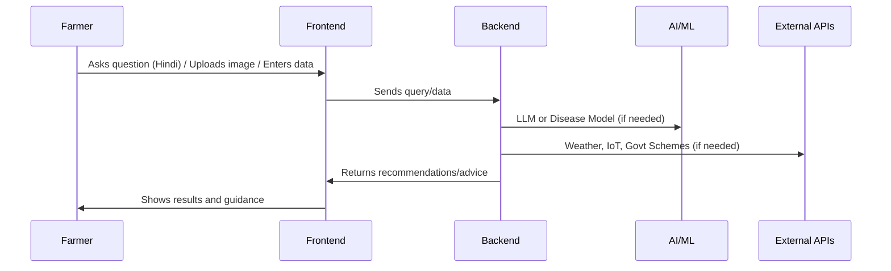

# Farmer Support Web App Architecture

---

## 1. Overview

A minimal, scalable web application to help farmers with crop guidance, real-time support, disease detection, weather insights, soil information, government schemes, and resource estimation. Designed for rapid prototyping and future expansion.

---

## 2. Features

| # | Feature                                                                 | Description                                                                                      |
|---|-------------------------------------------------------------------------|--------------------------------------------------------------------------------------------------|
| 1 | **Hindi Chat**                                                          | Chat interface for queries in Hindi, powered by LLM.                                             |
| 2 | **Disease Detection (Image)**                                           | Farmer uploads crop images; ML model detects disease & suggests treatment.                        |
| 3 | **Hyper-local Weather & Actions**                                       | Location-based weather data & actionable advice via APIs.                                         |
| 4 | **Soil Info via IoT**                                                   | Integrate soil sensors, analyze data, recommend crops.                                            |
| 5 | **Government Schemes Guidance**                                         | Crop/location-based scheme info from a database or API.                                           |
| 6 | **Fertilizer/Seed/Water Estimation**                                    | Calculator for quantities, pros/cons, and safety of inputs.                                       |

---

## 3. Architecture Diagram

```mermaid
flowchart TD
    A[Farmer User<br/>(Web/Mobile)] --> B[Frontend Web App<br/>(React/Next.js, Hindi, UI)]
    B --> C[Backend API<br/>(Node.js/Express)]
    C --> D1[LLM API<br/>(Hindi Q&A)]
    C --> D2[Plant Disease Model<br/>(Image ML)]
    C --> D3[Weather API]
    C --> D4[Soil IoT Service]
    C --> D5[Govt Scheme DB/API]
    C --> D6[Estimation Logic/DB]
    C --> E[Data Storage<br/>(MongoDB/PostgreSQL, S3)]
```

---

## 4. Technology Stack

| Layer       | Technology                        | Purpose                              |
|-------------|-----------------------------------|--------------------------------------|
| **Frontend**| React/Next.js, i18n, TailwindCSS  | UI, Hindi support, chat, image upload|
| **Backend** | Node.js, Express, REST, Socket.IO | API, orchestration, real-time updates|
| **AI/ML**   | LLM (Hindi), TF/PyTorch           | Chat, disease detection              |
| **External**| Weather API, IoT API, Govt. DB    | Hyperlocal weather, soil, schemes    |
| **Data**    | MongoDB/PostgreSQL, S3            | User, chat, crop, fertilizer storage |

---

## 5. Data Flow



---

## 6. Example Backend Routes

```plaintext
POST   /api/chat            // Hindi Q&A with LLM
POST   /api/disease-detect  // Crop image analysis
GET    /api/weather         // Hyperlocal weather fetch
GET    /api/soil-info       // IoT soil data
GET    /api/schemes         // Govt scheme info
POST   /api/estimate        // Fertilizer/seed/water calculation
```

---

## 7. Minimal UX Flow

```mermaid
graph TD
    H[Home / Language select]
    C[Chat (Ask questions)]
    D[Upload/Capture Image]
    W[Weather (Location + advice)]
    S[Soil info (Sensor/manual)]
    GS[Govt Schemes]
    E[Estimation Calculator]

    H --> C
    H --> D
    H --> W
    H --> S
    H --> GS
    H --> E
```

---

## 8. APIs & Integration Points

| Feature               | API Endpoint           | Integration           |
|-----------------------|-----------------------|-----------------------|
| Hindi Chat            | `/api/chat`           | LLM API (Hindi)       |
| Disease Detection     | `/api/disease-detect` | ML API                |
| Weather               | `/api/weather`        | Weather API           |
| Soil Info             | `/api/soil-info`      | IoT API               |
| Govt Schemes          | `/api/schemes`        | DB/Scraper/API        |
| Estimation            | `/api/estimate`       | Internal logic + DB   |

---

## 9. Summary Table

| Layer      | Technology        | Purpose                                     |
|------------|------------------|---------------------------------------------|
| Frontend   | React/Next.js    | UI, i18n, chat, image upload                |
| Backend    | Node.js/Express  | API orchestration, business logic           |
| AI/ML      | LLM, ML models   | Chat, image disease detection               |
| Data       | MongoDB/Postgres | User/chat/crop/fertilizer/history storage   |
| External   | Weather, IoT, Govt| Hyperlocal weather, soil, schemes          |

---

**This architecture is modular, minimal, and ready for incremental development.**
